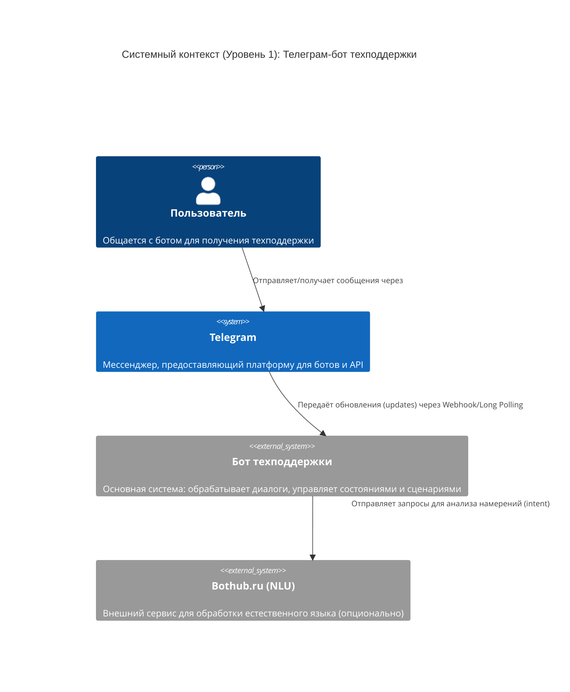
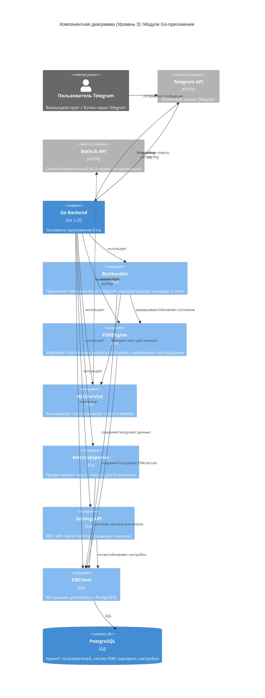
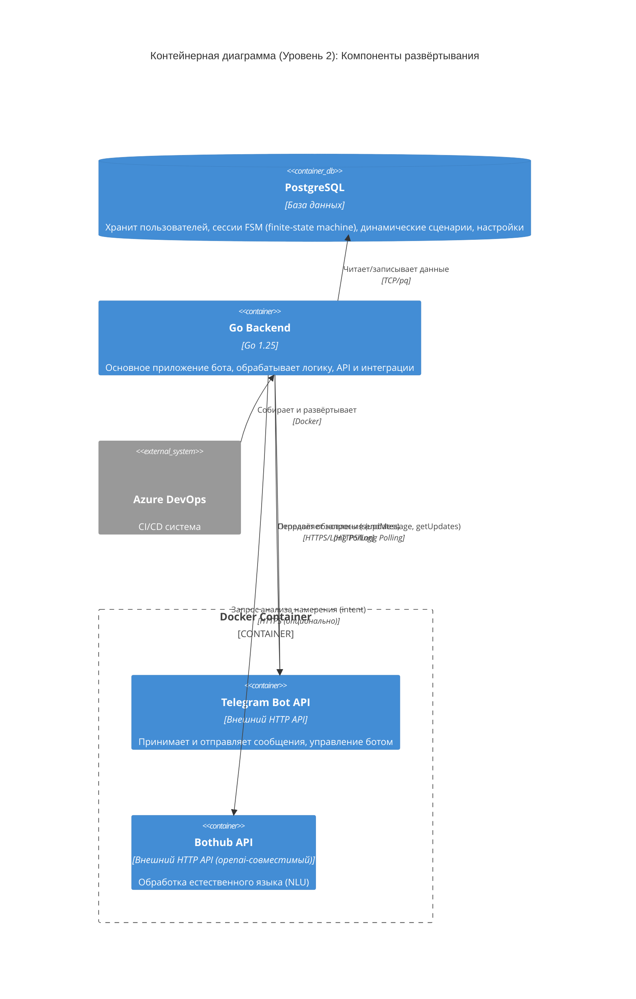

# Diagrams

## System context

```mermaid
C4Context
    title Системный контекст (Уровень 1): Телеграм-бот техподдержки

    Person(Пользователь, "Пользователь", "Общается с ботом для получения техподдержки")
    System(Телеграм, "Telegram", "Мессенджер, предоставляющий платформу для ботов и API")
    System_Ext(Бот, "Бот техподдержки", "Основная система: обрабатывает диалоги, управляет состояниями и сценариями")
    System_Ext(Bothub, "Bothub.ru (NLU)", "Внешний сервис для обработки естественного языка (опционально)")

    Rel(Пользователь, Телеграм, "Отправляет/получает сообщения через")
    Rel(Телеграм, Бот, "Передаёт обновления (updates) через Webhook/Long Polling")
    Rel(Бот, Bothub, "Отправляет запросы для анализа намерений (intent)")
    UpdateRelStyle(Бот, Bothub, $offsetY="-40", $offsetX="60")

    UpdateLayoutConfig($c4ShapeInRow="3", $c4BoundaryInRow="1")
```

## Component

```mermaid
C4Component
    title Компонентная диаграмма (Уровень 3): Модули Go-приложения
    Person_Ext(user, "Пользователь Telegram", "Взаимодействует с ботом через Telegram")
    Container_Ext(telegram, "Telegram API", "HTTPS", "Облачный сервис Telegram")
    Container_Ext(bothub, "Bothub API", "HTTPS", "OpenAI-совместимый NLU-сервис (опционально)")
    Container(goApp, "Go Backend", "Go 1.25", "Основное приложение бота")
    
    Component(botHandler, "BotHandler", "Go", "Принимает обновления от Telegram, маршрутизирует команды и текст")
    Component(fsmEngine, "FSMEngine", "Go", "Управляет состоянием диалога (сессиями), сценариями техподдержки")
    Component(nluService, "NLUService", "Go", "Анализирует текст, извлекает intent и entities")
    Component(metricsExporter, "MetricsExporter", "Go", "Предоставляет /api/v1/metrics для Prometheus")
    Component(settingsApi, "SettingsAPI", "Go", "REST API /api/v1/settings (защищён токеном)")
    Component(dbClient, "DBClient", "Go", "Абстракция для работы с PostgreSQL")
    ContainerDb(database, "PostgreSQL", "БД", "Хранит: пользователей, сессии FSM, сценарии, настройки")

    Rel(user, telegram, "Отправляет сообщения")
    Rel(telegram, goApp, "long polling", "HTTPS")
    Rel(goApp, telegram, "Отправляет ответы", "HTTPS")

    Rel_L(goApp, botHandler, "использует")
    Rel_L(goApp, fsmEngine, "использует")
    Rel_L(goApp, nluService, "использует")
    Rel_R(goApp, metricsExporter, "использует")
    Rel_R(goApp, settingsApi, "использует")
    Rel(goApp, dbClient, "использует")

    Rel(botHandler, fsmEngine, "запрашивает/обновляет состояние")
    Rel(botHandler, nluService, "передаёт текст для анализа")
    Rel(botHandler, dbClient, "сохраняет/загружает данные")

    Rel(fsmEngine, dbClient, "сохраняет/загружает FSM-сессии")
    Rel(nluService, bothub, "вызывает NLU", "HTTPS")
    Rel(settingsApi, dbClient, "читает/обновляет настройки")
    Rel(metricsExporter, dbClient, "считывает данные для метрик")

    Rel(dbClient, database, "SQL")

UpdateRelStyle(nluService, bothub, "dashed", "#666")    
```

## Container

```mermaid
C4Container
    title Контейнерная диаграмма (Уровень 2): Компоненты развёртывания

    ContainerDb(БазаДанных, "PostgreSQL", "База данных", "Хранит пользователей, сессии FSM (finite-state machine), динамические сценарии, настройки")
    Container(GoПриложение, "Go Backend", "Go 1.25", "Основное приложение бота, обрабатывает логику, API и интеграции")
    Container_Boundary(c1, "Docker Container") {
        Container(TelegramAPI, "Telegram Bot API", "Внешний HTTP API", "Принимает и отправляет сообщения, управление ботом")
        Container(BothubAPI, "Bothub API", "Внешний HTTP API (openai-совместимый)", "Обработка естественного языка (NLU)")
    }

    System_Ext(CI_CD, "Azure DevOps", "CI/CD система", "Сборка, тестирование и развёртывание контейнера")

    Rel(GoПриложение, БазаДанных, "Читает/записывает данные", "TCP/pq")
    Rel(GoПриложение, TelegramAPI, "Отправляет запросы (sendMessage, getUpdates)", "HTTPS/Long Polling")
    Rel_Back(TelegramAPI, GoПриложение, "Передаёт обновления (updates)", "HTTPS/Long Polling")
    Rel(GoПриложение, BothubAPI, "Запрос анализа намерения (intent)", "HTTPS (опционально)")
    Rel(CI_CD, GoПриложение, "Собирает и развёртывает", "Docker")

    UpdateRelStyle(GoПриложение, BothubAPI, $offsetY="20", $offsetX="-30")
```