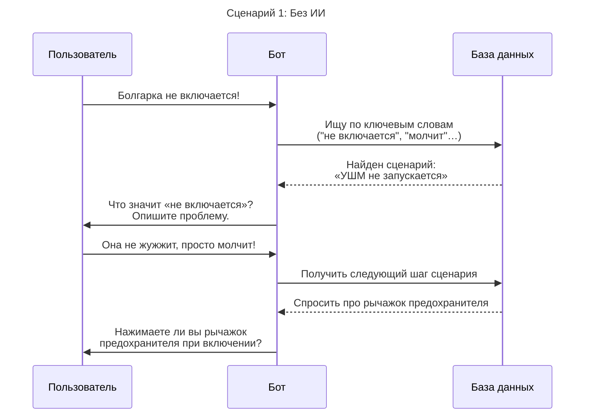
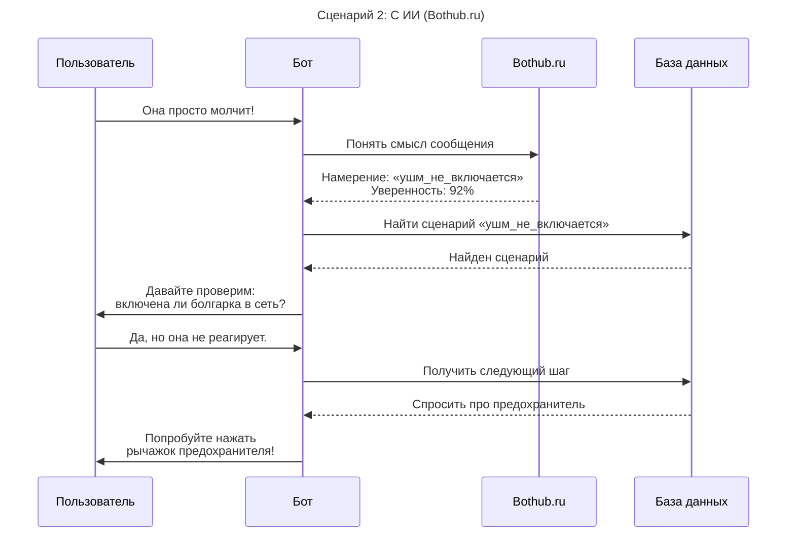

# Диаграмы последовательности
## Без ИИ (машина состояний)

```mermaid
sequenceDiagram
    title Сценарий 1: Без ИИ
    participant Пользователь
    participant Бот
    participant База данных

    Пользователь->>Бот: Болгарка не включается!
    Бот->>База данных: Ищу по ключевым словам<br>("не включается", "молчит"…)
    База данных-->>Бот: Найден сценарий:<br>«УШМ не запускается»
    Бот->>Пользователь: Что значит «не включается»?<br>Опишите проблему.
    Пользователь->>Бот: Она не жужжит, просто молчит!
    Бот->>База данных: Получить следующий шаг сценария
    База данных-->>Бот: Спросить про рычажок предохранителя
    Бот->>Пользователь: Нажимаете ли вы рычажок<br>предохранителя при включении?
```

## С ИИ для распознавания запроса пользователя

```mermaid
sequenceDiagram
    title Сценарий 2: С ИИ (Bothub.ru)
    participant Пользователь
    participant Бот
    participant Bothub.ru
    participant База данных

    Пользователь->>Бот: Она просто молчит!
    Бот->>Bothub.ru: Понять смысл сообщения
    Bothub.ru-->>Бот: Намерение: «ушм_не_включается»<br>Уверенность: 92%
    Бот->>База данных: Найти сценарий «ушм_не_включается»
    База данных-->>Бот: Найден сценарий
    Бот->>Пользователь: Давайте проверим:<br>включена ли болгарка в сеть?
    Пользователь->>Бот: Да, но она не реагирует.
    Бот->>База данных: Получить следующий шаг
    База данных-->>Бот: Спросить про предохранитель
    Бот->>Пользователь: Попробуйте нажать<br>рычажок предохранителя!
```
